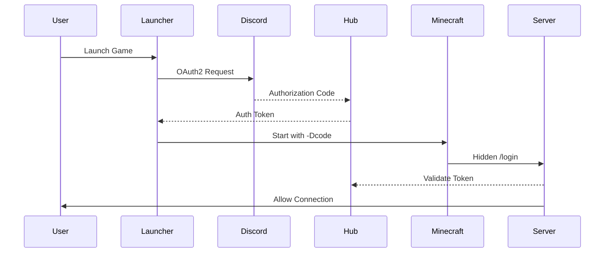

# 🎮 The Normal Project

<div align="center">


_A comprehensive authentication ecosystem for Minecraft servers, powered by Discord OAuth2_

[Features](#-features) • [Architecture](#-architecture) • [Installation](#-installation) • [Components](#-components) • [Flow](#-authentication-flow)

</div>

## 🌟 Features

- **Seamless Authentication** via Discord OAuth2
- **Auto-updating System** for both launcher and modpacks
- **Achievement Tracking** with points and rewards
- **Cross-platform Support** for Windows, macOS, and Linux
- **Anti-alt Account System** through Discord account linking
- **Rich Discord Integration** with stats and commands

## 🏗️ Architecture

The project consists of six main components working in harmony:

### 🚀 Launcher

- **Tech Stack**: Electron, Vue.js, Python
- **Features**:
  - Achievement display
  - Points tracking
  - Event announcements
  - Newsletter updates
  - Auto-updating system

### 💾 Installer

- **Tech Stack**: Python, Tkinter
- **Purpose**: Streamlined launcher deployment
- **Features**: One-click installation

### 🌐 Hub

- **Tech Stack**: Python, FastAPI, MongoDB
- **Role**: Central authentication service
- **Features**:
  - OAuth2 handling
  - Token management
  - User data storage
  - API endpoints

### 🤖 Discord Bot

- **Tech Stack**: Python, Interactions
- **Features**:
  - Player statistics
  - Admin controls
  - Modpack management
  - Update broadcasting

### 🔌 Client Mod

- **Tech Stack**: Java, Forge
- **Purpose**: Authentication bridge
- **Features**: Secure token handling

### 🛡️ Server Plugin

- **Tech Stack**: Kotlin, PaperMC
- **Purpose**: Server-side verification
- **Features**: Token validation

## 📁 Project Structure

```
normal-project/
├── minecraft/           # Java/Kotlin projects
│   ├── mod/     # Forge client mod
│   └── plugin/  # PaperMC plugin
├── installer/          # Python installer
├── launcher/           # Electron application
├── hub/                # Backend services
```

## 🔒 Authentication Flow



1. 🎮 User initiates login through launcher
2. 🔑 Discord OAuth2 flow begins
3. 🌐 Hub processes authentication
4. 🎯 Launcher receives auth token
5. ⚡ Minecraft starts with custom flag
6. 🔒 Server validates and allows connection

---

<div align="center">

**Built with for the "Isso é Normal?" Minecraft community**

</div>
